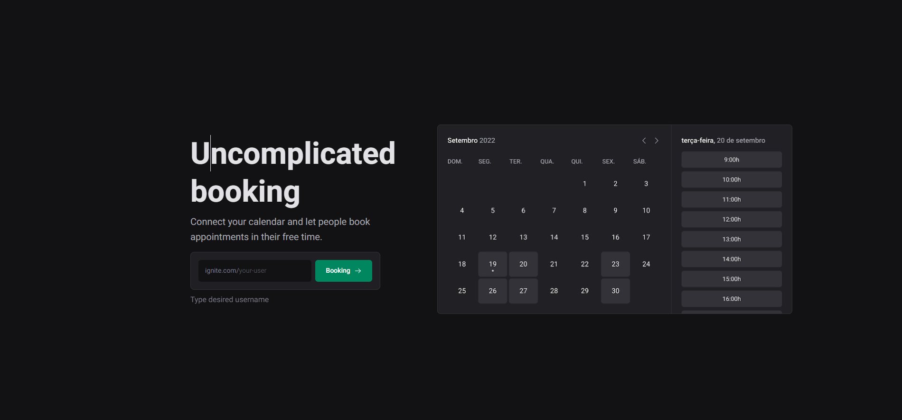
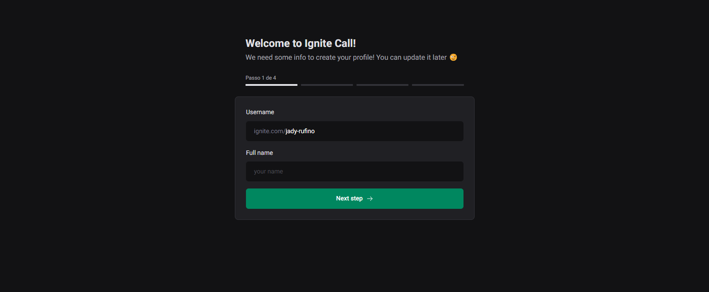
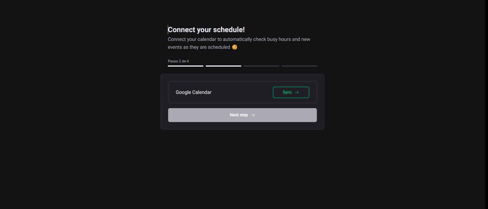
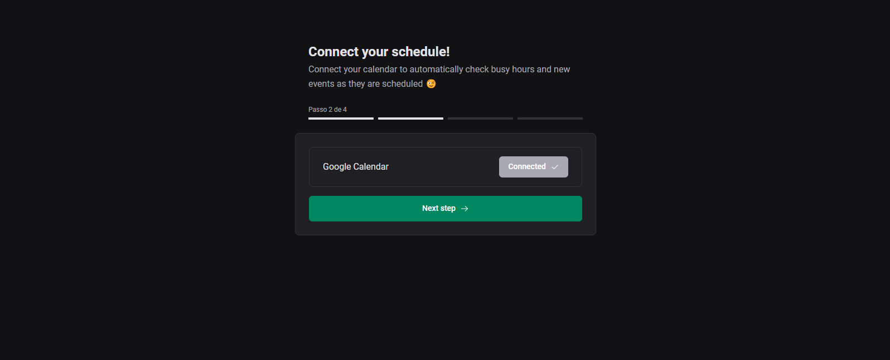
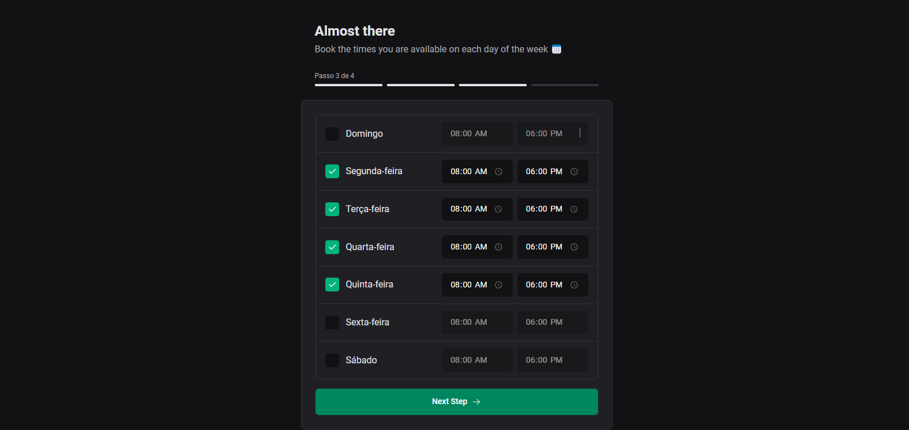
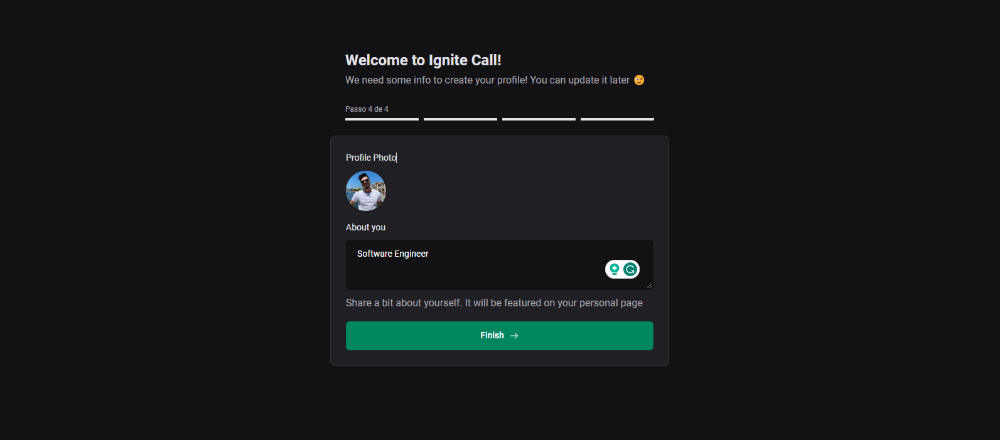
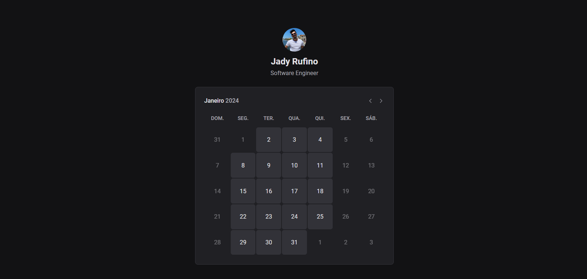
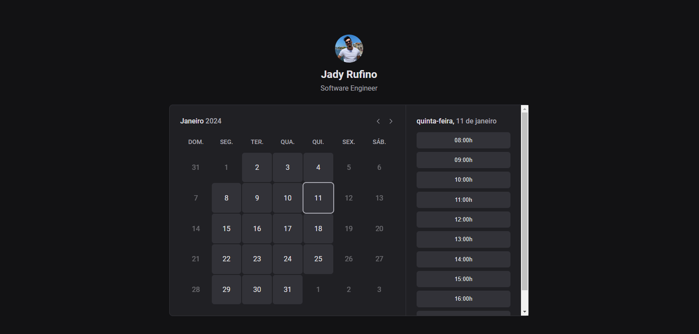
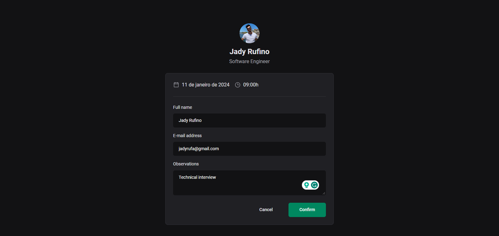

<h1 align="center">
  
  Ignite Call
</h1>

<p>
  
</p>

<p align="center">
 <a href="#-about">About</a> |
 <a href="#-deploy">Deploy</a> |
 <a href="#-layout">Layout</a> | 
 <a href="#-how-it-works">How It Works</a> | 
 <a href="#-technologies">Technologies</a> | 
 <a href="#-author">Author</a> | 
 <a href="#-license">License</a>
</p>

## 💻 About

The **Ignite Call** project is a scheduling application that allows users to share their calendar and let others book available times. The application also integrates with `Google Calendar` for viewing appointments on different platforms. We developed this project using a custom `Design System`, the `Next.js` framework for the front-end, and the `Prisma` ORM for database interactions, including validations and more.

---

## 🔗 Deploy

The application's deployment can be accessed through the following base URL: https://vercel.com/dyjarufa/ignite-call/2QjkAoXiZdCbGd7M22CFmZLnev7Q

---

## 🎨 Layout

You can view the project layout through [this link](https://www.figma.com/community/file/1161274296921389678). An account on [Figma](https://www.figma.com/) is required to access it.

See a visual demonstration of the main screens of the application:

### Landing

<p align="center">
  
</p>

### Registration

<p align="center">
  
</p>

<p align="center">
  
</p>

<p align="center">
  
</p>

<p align="center">
  
</p>

### Calendar

<p align="center">
  
</p>

<p align="center">
  
</p>

<p align="center">
  

  <p align="center">
  
</p>

---

## 🚀 How it works

### Prerequisites

Before downloading the project, you need to have the following tools installed on your machine:

- [Git](https://git-scm.com)
- [NodeJS](https://nodejs.org/en/)
- [Yarn](https://yarnpkg.com/) or [NPM](https://www.npmjs.com/)
- For the database, have [MySQL](https://www.mysql.com/) or [Docker](https://www.docker.com/) to download the database image.

It's also good to have an editor to work with the code like [VSCode](https://code.visualstudio.com/)

### Cloning and Running

Step by step to clone and run the application on your machine:

```bash
# Clone this repository
$ git clone git@github.com:jadyrufa/ignite-call.git

# Access the project folder in the terminal
$ cd ignite-call

# Install the dependencies
$ npm install

# Create a .env file and fill it as shown in the .env.example file

# Run your database

# Execute the following command to create the migrations in the database
$ npx prisma migrate dev

# Run the application in development mode
$ npm run dev

# The application will start on an available port that can be accessed through the browser
```

## 🛠 Technologies

As seguintes principais ferramentas foram usadas na construção do projeto:

- **[typeScript](https://www.typescriptlang.org/)**
- **[next.js](https://nextjs.org/)**
- **[@ignite-ui/react](https://www.npmjs.com/package/@ignite-ui/react)**
- **[prisma](https://www.prisma.io/)**
- **[react-hook-form](https://react-hook-form.com/)**
- **[zod](https://zod.dev/)**
- **[@hookform/resolvers](https://www.npmjs.com/package/@hookform/resolvers)**
- **[phosphor-icons](https://phosphoricons.com/)**
- **[@tanstack/react-query](https://tanstack.com/query/latest)**
- **[axios](https://axios-http.com/ptbr/docs/intro)**
- **[cookies-next](https://www.npmjs.com/package/cookies-next)**
- **[next-auth](https://next-auth.js.org/)**
- **[next-seo](https://github.com/garmeeh/next-seo)**
- **[dayjs](https://day.js.org/)**
- **[docker](https://www.docker.com/)**
- **[`Google api`](https://console.cloud.google.com/apis/library)**

> Para mais detalhes das dependências gerais da aplicação veja o arquivo [package.json](./package.json)

## 📝 License

This project is under the MIT license. See the LICENSE file for more information.

Made with 💜 by Jady Rufino 👋🏽 [Get in touch!](https://www.linkedin.com/in/jady-rufino/)
